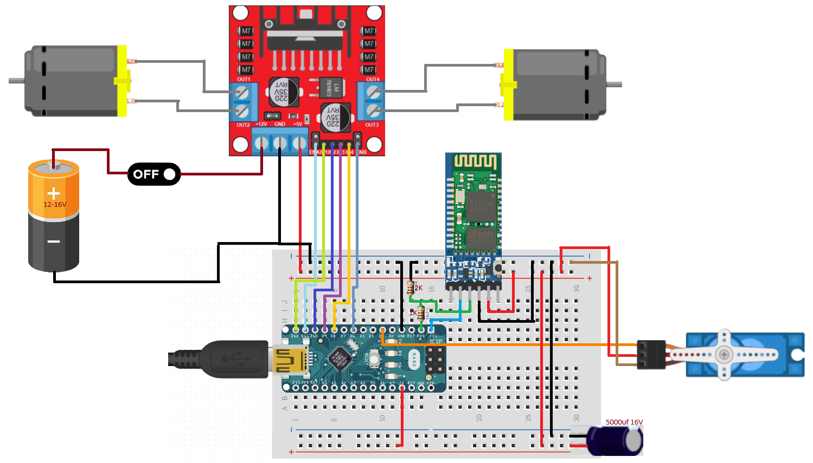
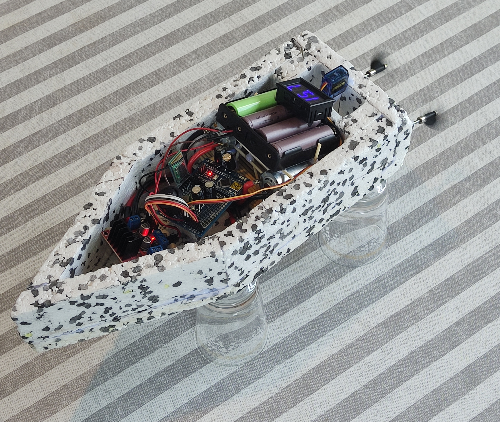
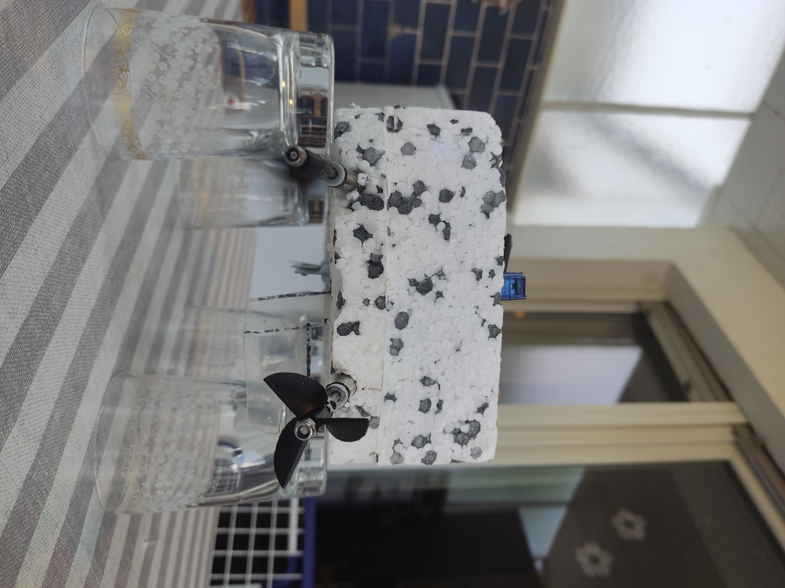
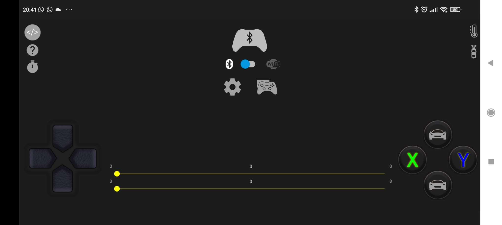
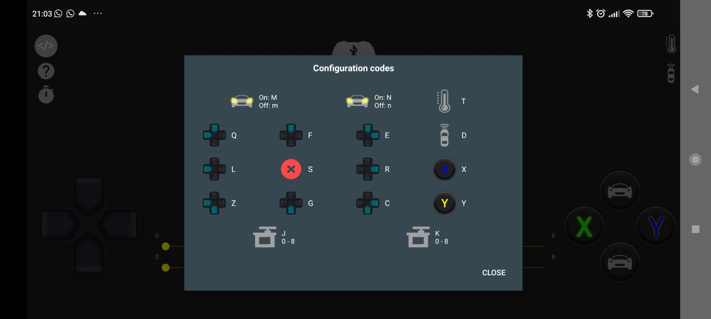

# rc-arduino-bluetooth-boat
Arduino-basiertes RC-Boot-Projekt, das von Android gesteuert wird.
# RC Bluetooth-gesteuertes Boot 🚤📡

Dieses Projekt ist ein RC-Boot (ferngesteuertes Boot), das über ein Android-Telefon per Bluetooth gesteuert wird. Das Boot empfängt Befehle über ein HC-05-Bluetooth-Modul und steuert Motoren mit Hilfe eines Arduino Nano.

---

## 📌 Merkmale

- Drahtlose Steuerung mit der Android-App „Arduino Car“
  (https://play.google.com/store/apps/details?id=com.electro_tex.bluetoothcar&pcampaignid=web_share)
- Bluetooth-Kommunikation mit HC-05 Modul
- Steuerung von zwei DC-Motoren und einem Servo (vorwärts, rückwärts, rechts, links)
- Einfache und leichte Arduino-Codebasis
- Leicht aufzubauen mit gängigen Elektronikkomponenten

---

## 🛠 Verwendete Hardware

- Arduino Nano (auch andere Arduino-Modelle möglich)
- HC-05 Bluetooth-Modul
- L298N Motortreiber
- 2x DC Motor (R390)
- 1x SG90 Servomotor
- 4x 18650 Lithium-Akku (12–16V)
- Bootsgehäuse (3D-gedruckt oder handgefertigt)
- 5000µF Kondensator (> 5V)
- Ein/Aus-Schalter

---

## 📱 Android-App

- Verwendete App: `Arduino Car`  
  Play Store Link: https://play.google.com/store/apps/details?id=com.electro_tex.bluetoothcar&pcampaignid=web_share

### Tastenbelegung:

- Vorwärts (D): 'M'
- Rückwärts (R): 'm'
- Gasstufe: "J0-8"
- Links: 'L'
- Rechts: 'R'
- Geradeaus: 'S' (wird gesendet, wenn Links-/Rechts-Taste losgelassen wird)
- Kalibrierung: 'X' & 'Y'
- Kalibrierung zurücksetzen: 'N' & 'n'

> Hinweis: Zusätzliche Funktionen können mit Tasten wie Q, F, E, Z, G, C, K0–8 hinzugefügt werden.

---

## 🧠 Funktionsweise

1. Die Android-App sendet Steuerzeichen über Bluetooth (z. B. 'M', 'R', 'L', "J0-8")
2. Der Arduino liest diese Zeichen über die serielle Schnittstelle
3. Entsprechend steuert der Arduino den L298N-Motortreiber
4. Das Boot bewegt sich gemäß den erhaltenen Befehlen

---

## 🔌 Schaltplan

---

## 🚀 Einrichtung

1. Die Datei `bluetooth_boat.ino` auf den Arduino hochladen  
> ⚠️ **Wichtig:** Vor dem Hochladen unbedingt die RX- und TX-Verbindungen zum HC-05-Modul trennen, da sie den Upload-Prozess stören können.
2. Verkabelung gemäß Schaltplan vornehmen
3. Android-App "Arduino Car" öffnen und mit dem HC-05 koppeln (PIN ist normalerweise `1234` oder `0000`)
4. Im Einstellungsmenü „J0-180“ in „J0-8“ ändern
5. Im Menü die Tastencodes prüfen
6. Jetzt kann die Fahrt beginnen!

---

## 📸 Projektbilder

---

## 📄 Lizenz

Copyright (c) 2025 Mehmet Özdemir

Permission is hereby granted, free of charge, to any person obtaining a copy
of this software and associated documentation files (the "Software"), to deal
in the Software without restriction, including without limitation the rights
to use, copy, modify, merge, publish, distribute, sublicense, and/or sell
copies of the Software, and to permit persons to whom the Software is
furnished to do so, subject to the following conditions:

The above copyright notice and this permission notice shall be included in all
copies or substantial portions of the Software.

THE SOFTWARE IS PROVIDED "AS IS", WITHOUT WARRANTY OF ANY KIND, EXPRESS OR
IMPLIED, INCLUDING BUT NOT LIMITED TO THE WARRANTIES OF MERCHANTABILITY,
FITNESS FOR A PARTICULAR PURPOSE AND NONINFRINGEMENT. IN NO EVENT SHALL THE
AUTHORS OR COPYRIGHT HOLDERS BE LIABLE FOR ANY CLAIM, DAMAGES OR OTHER
LIABILITY, WHETHER IN AN ACTION OF CONTRACT, TORT OR OTHERWISE, ARISING FROM,
OUT OF OR IN CONNECTION WITH THE SOFTWARE OR THE USE OR OTHER DEALINGS IN THE
SOFTWARE.

---

## ✨ Entwickler

**Name:** Mehmet Özdemir  
**GitHub:** [https://github.com/mehmetoziron](https://github.com/mehmetoziron)
